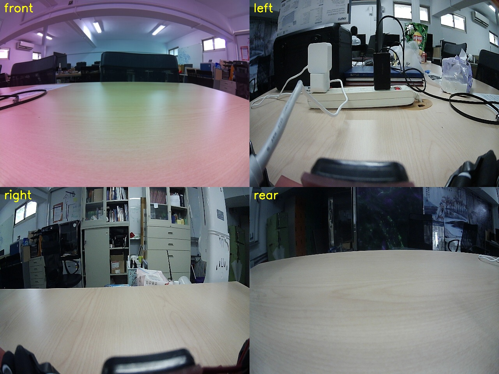
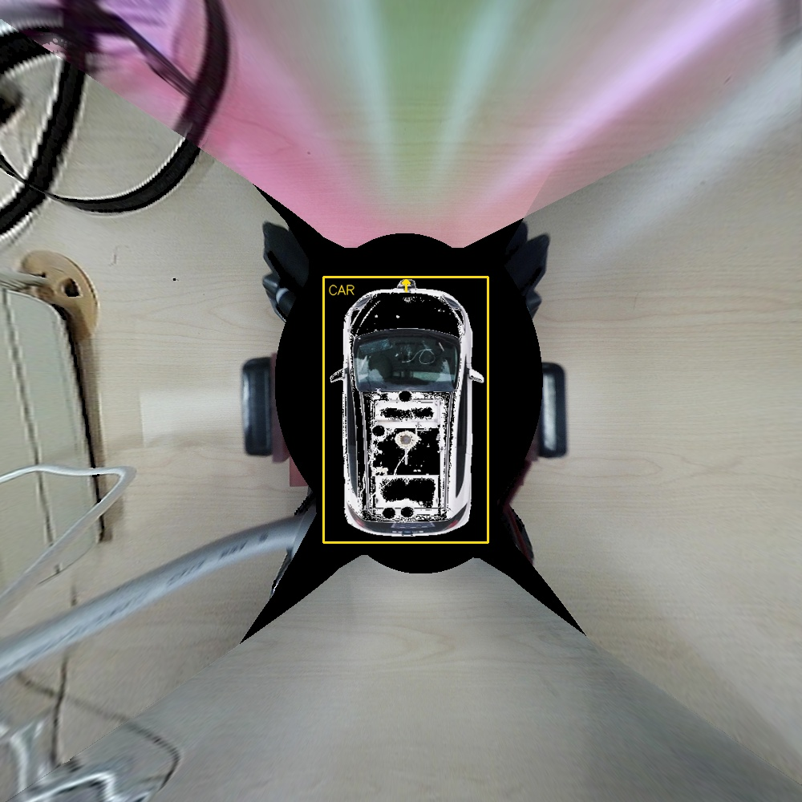
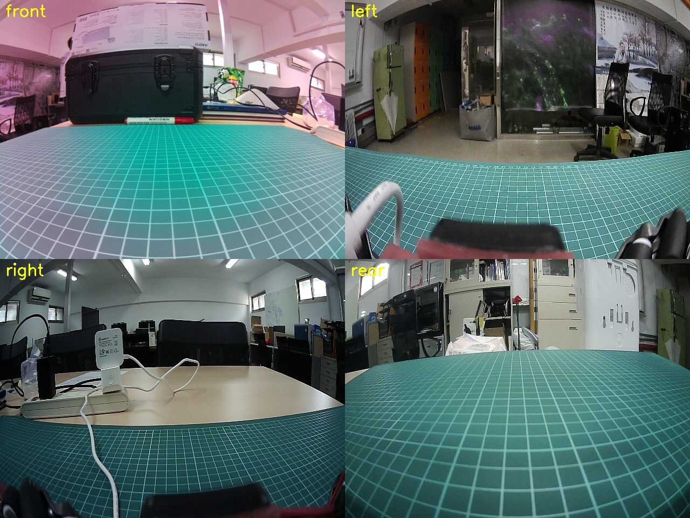
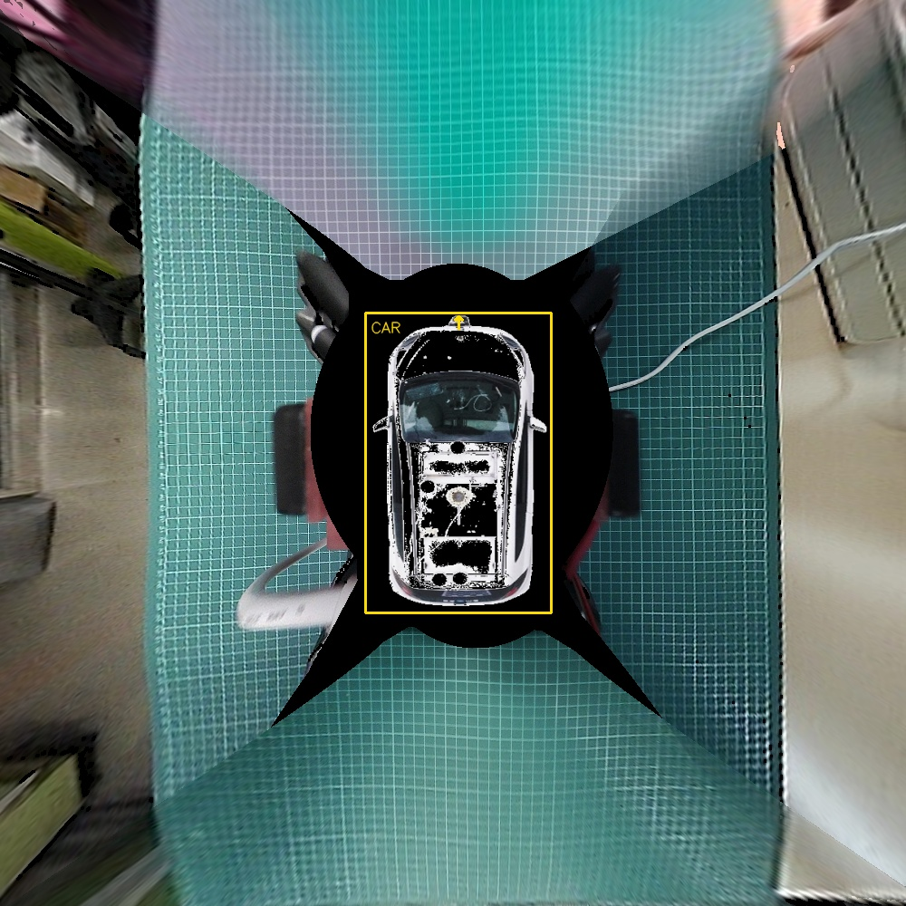
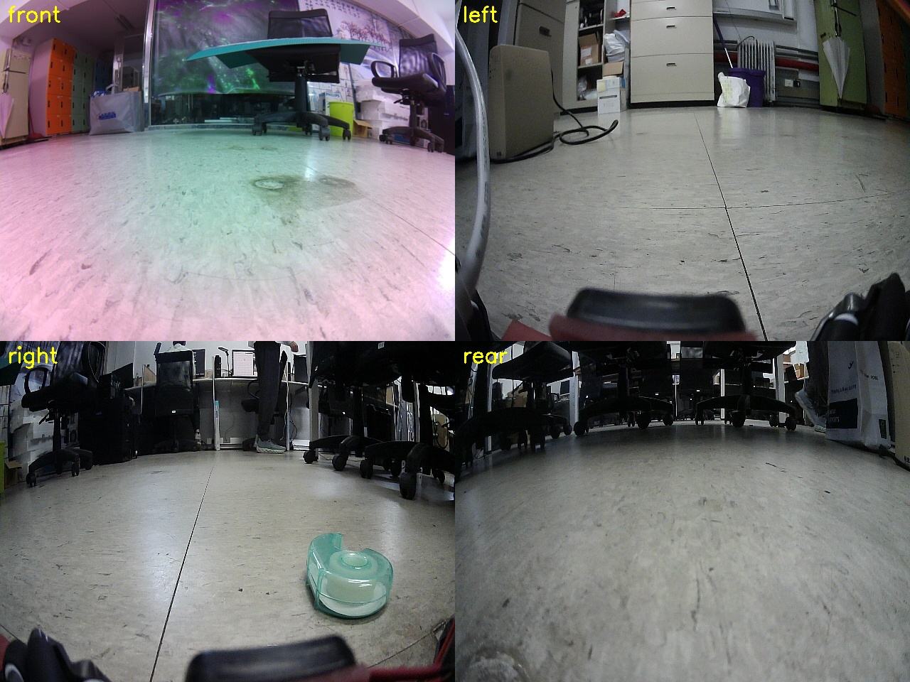
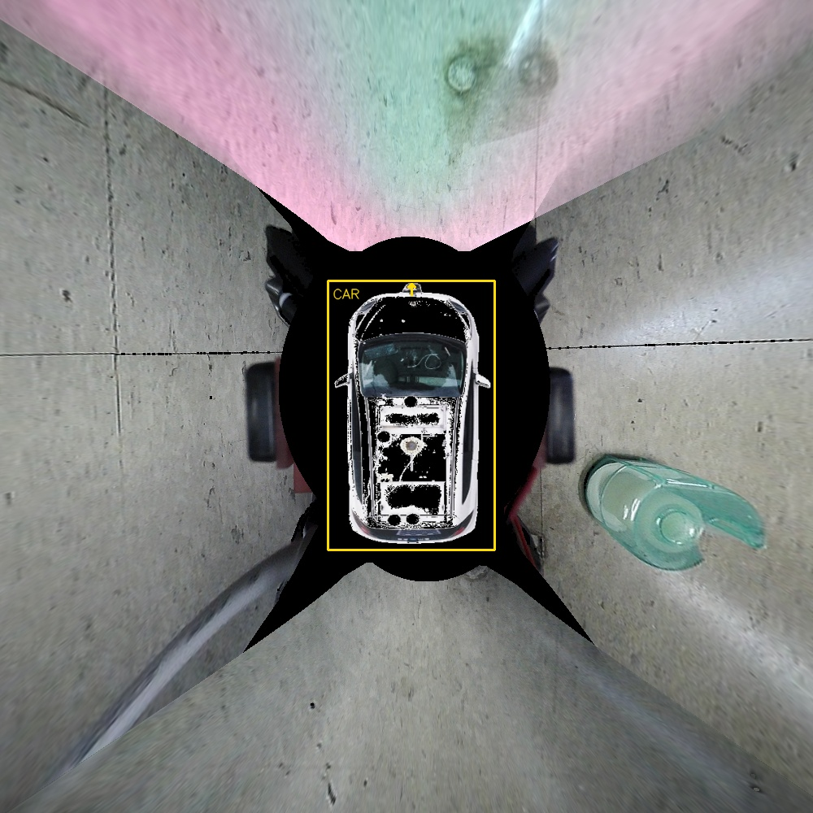
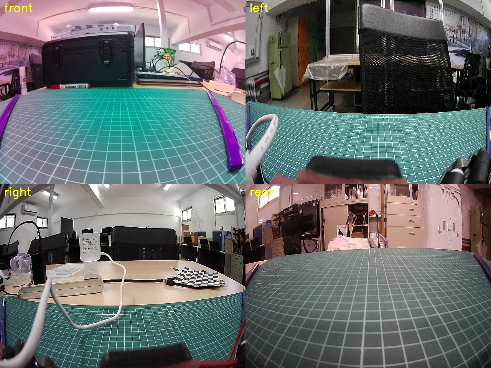
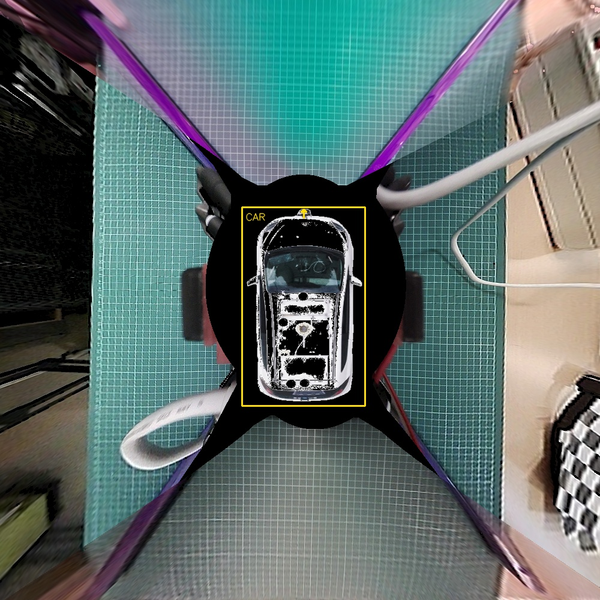

## Smart Car

這個 repository 是基於 Freenove 4WD Smart Car Kit for Raspberry Pi 改裝後的個人測試版本。  
目前重點是保存整台車的功能測試、續航測試、硬體校正參數，以及四相機幾何環景（IPM）校正結果，方便日後重新部署或維修時快速確認。

詳細操作筆記請看：

```text
CAR_TESTING_GUIDE.md
```

## 目前車體改裝摘要

- 馬達齒比改為 `1:120`，原本為 `1:48`
- 2 個 Pi Camera / CSI camera
- 3 個 USB camera
- 車頭 2 個 servo
- 底部 3 個循跡感測器
- 額外 6 個紅外線避障感測器
- 外接 USB 麥克風與喇叭
- 電池電壓偵測與百分比估算
- LED 目前先跳過測試

## 主要測試程式

進入 Server 目錄：

```bash
cd /home/pi/Freenove_4WD_Smart_Car_Kit_for_Raspberry_Pi/Code/Server
```

整車系統測試：

```bash
python3 full_car_test.py --test system
```

只測試五顆相機：

```bash
python3 full_car_test.py --test cameras
```

只測試喇叭、麥克風錄音與錄音回放：

```bash
python3 full_car_test.py --test audio
```

續航壓力測試：

```bash
python3 endurance_test.py
```

## 整車系統測試內容

`full_car_test.py --test system` 會依序測：

- 電池電壓與光敏 ADC
- 超聲波感測器
- 底部車道線循跡感測器
- 額外 6 個紅外線避障感測器
- 車頭 2 個 servo
- 蜂鳴器
- 外接喇叭播放、麥克風錄音與錄音回放
- 5 個相機（2 CSI + 3 USB，依序開啟）
- 基本馬達移動
- 麥克納姆輪移動

LED 預設跳過。若之後要包含 LED：

```bash
python3 full_car_test.py --test system --include-led
```

## 已校正參數

馬達基本測試：

```bash
python3 full_car_test.py --test basic-drive
```

目前預設校正值：

```text
turn-speed = 900
left-turn-90-duration = 2.4
right-turn-90-duration = 2.1
```

額外 6 個紅外線避障感測器 GPIO：

```text
GPIO26, GPIO20, GPIO19, GPIO16, GPIO6, GPIO12
```

避障感測器目前為 LOW 觸發：

```text
GPIO 讀到 LOW  -> obstacle=1
GPIO 讀到 HIGH -> obstacle=0
```

USB 相機配置：

```text
front = CSI Picamera camera_num=1
left  = usb-xhci-hcd.1-1
right = usb-xhci-hcd.0-2
rear  = usb-xhci-hcd.0-1.2
```

USB 的 `/dev/videoX` 編號可能在重開機或重新插拔後改變。程式會根據
`camera_hardware.json` 的 `usb_bus`，在每次拍攝前重新尋找該相機的第一個
V4L2 capture node，不應只依賴固定的 `/dev/videoX`。

USB 音效卡：

```text
plughw:2,0
```

音效卡編號也可能在重開機後改變，請用 `aplay -l` 與 `arecord -l` 確認。

## 五相機拍攝設定

目前 `python3 full_car_test.py --test cameras` 使用：

```text
CSI camera 0、1 : 1920x1440（4:3，保留 IMX219 完整視角）
USB left/right/rear: 1920x1080，YUYV，6 FPS
```

三顆 USB 相機皆為 `BL 1080p S10`，使用相同拍攝設定。YUYV 可避免部分 USB
鏈路在 1920x1080 MJPEG 模式發生 `Corrupt JPEG data`。USB 測試照片會寫入
相機位置、型號、感光元件、拍攝時間與軟體等 EXIF 資訊。

輸出位置：

```text
Code/Server/camera_test_images/
```

## 四相機環景（目前正式方法）

演算法是**幾何式環景 / IPM**（Inverse Perspective Mapping），不是深度學習 BEV。  
流程：魚眼去畸變 → 每路地面單應 `H` → 扇形遮罩＋羽化拼接。  
**不需要俯看圖。** 換場景可沿用同一組 `K/D/H`，前提是鏡頭相對車身沒被碰歪。

**拼接成功的關鍵：** 不是對齊俯拍照，而是把**四面棋盤在地面上的真實座標**（以及車身四角）量好寫進 layout。  
每路影像偵測棋盤角點後，與這些公制座標對應，才能估出把畫面拉到同一俯視平面的 `H`。四面座標缺一、或量錯，那路就會歪、對不齊。

座標檔：

```text
Code/Server/calibration_patterns/metric_layout_aug3.json
```

裡面包含：墊子尺寸、每路棋盤一個已知角的 (long, short) cm、車身四角 cm。  
腳本 `metric_extrinsic_from_boards.py` 依此算出 `bev_extrinsic_metric_auto/` 的四個 `H`。

四路對應（USB 編號會變，一律用 `usb_bus`）：

```text
front = CSI Picamera2 camera_num=1（IMX219，內參用 fisheye）
left  = USB usb-xhci-hcd.1-1
right = USB usb-xhci-hcd.0-2
rear  = USB usb-xhci-hcd.0-1.2
```

正式外參（公制棋盤）：

```text
Code/Server/calibration_patterns/bev_extrinsic_metric_auto/
```

右側 `H` 必須是 `flip_h + flip_v`（繞右側棋盤在 BEV 上的中心）。  
缺 `flip_v` 會把右後地面映到右前（例如綠膠帶會跑到右前輪）。  
2026-08-06 確認版地縫差約 dy≈16 px，不要改用車身中心當 pivot 覆蓋。

### 如何拍攝並拼出環景

1. 確認相機沒被其他程式佔用，重開機後先對一下 USB 節點：

```bash
v4l2-ctl --list-devices
```

每個 USB Camera 條目下**第一個** `/dev/videoX` 才是擷取節點。程式會依 `camera_hardware.json` 的 `usb_bus` 自動對應，不要寫死編號。

2. 進入 Server 目錄，四路各拍一張並立刻拼接：

```bash
cd /home/pi/Freenove_4WD_Smart_Car_Kit_for_Raspberry_Pi/Code/Server
python3 capture_live_surround.py --stitch
```

腳本會：**先拍 USB left → right → rear，再拍 CSI front**（先開 CSI 容易跟 USB 搶裝置）。  
USB 優先用 YUYV；左側會連拍多幀，挑撕裂較小的一張。

3. 看結果：

```text
四路原圖：Code/Server/camera_labeled_live_now/{front,left,right,rear}.jpg
四路併圖：Code/Server/bev_output/live_now_stitch/raw_2x2.jpg
環景結果：Code/Server/bev_output/live_now_stitch/surround_square.jpg
```

只拍照、先不拼接：

```bash
python3 capture_live_surround.py
```

已有四張圖（檔名需含 `front` / `left` / `right` / `rear`）時，手動部署再拼接：

```bash
python3 bev_deploy.py \
  --extrinsic-dir calibration_patterns/bev_extrinsic_metric_auto \
  --labeled-dir camera_labeled_live_now

python3 bev_stitch.py --blend --feather 40 \
  --car-width 207 --car-height 333 \
  --car-center-x 506 --car-center-y 511 \
  --output-dir bev_output/live_now_stitch
```

車身遮罩數字來自  
`calibration_patterns/bev_extrinsic_metric_auto/metric_extrinsic_auto_summary.json` 的 `car_mask_px`。

常見狀況：

- 左側畫面像被橫切、地磚縫錯位：MJPG 撕裂。腳本已優先 YUYV。
- `select() timeout` 卡住很久：USB 被佔用或 MJPG 掛住。關掉其他預覽後重跑。
- 環景右後標物跑到右前：右側 `H` 缺 `flip_v`，不要自行覆蓋 `camera_right_H.npy`。
- 換場景拼得出圖，但對角黑洞／遠方模糊：幾何極限，不是沒拍到檔。

更細的注意事項：`Code/Server/BEV_LIVE_CAPTURE.md`

### 範例結果

左欄為四路原圖（`raw_2x2.jpg`），右欄為拼接環景（`surround_square.jpg`）。圖片在 `docs/bev_examples/`。

#### 在桌上

<table>
<tr>
<td width="50%"></td>
<td width="50%"></td>
</tr>
<tr>
<td align="center">四路原圖</td>
<td align="center">環景結果</td>
</tr>
</table>

#### 在綠色桌墊

<table>
<tr>
<td width="50%"></td>
<td width="50%"></td>
</tr>
<tr>
<td align="center">四路原圖</td>
<td align="center">環景結果</td>
</tr>
</table>

#### 放在地上

<table>
<tr>
<td width="50%"></td>
<td width="50%"></td>
</tr>
<tr>
<td align="center">四路原圖</td>
<td align="center">環景結果</td>
</tr>
</table>

#### 有放磁鐵

<table>
<tr>
<td width="50%"></td>
<td width="50%"></td>
</tr>
<tr>
<td align="center">四路原圖</td>
<td align="center">環景結果</td>
</tr>
</table>

主要程式：

```text
Code/Server/capture_live_surround.py      # 現場四路拍攝（可 --stitch）
Code/Server/metric_extrinsic_from_boards.py
Code/Server/bev_deploy.py
Code/Server/bev_stitch.py
Code/Server/camera_hardware.json
```

## 續航壓力測試

一般續航測試：

```bash
python3 endurance_test.py
```

車子架高後，啟用馬達負載：

```bash
python3 endurance_test.py --enable-motor-load --yes
```

先跑 10 分鐘確認流程：

```bash
python3 endurance_test.py --enable-motor-load --yes --max-minutes 10
```

停止條件：

```text
連續 3 次電壓 <= 6.8V 才停止
```

續航紀錄會輸出到：

```text
Code/Server/endurance_logs/
```

## 重開機後需要確認

重開機後通常可以直接執行：

```bash
python3 full_car_test.py --test system
```

若音訊或相機失效，先確認 USB 編號是否改變。

確認 USB 音效卡：

```bash
aplay -l
arecord -l
```

確認 USB 相機：

```bash
v4l2-ctl --list-devices
```

目前音訊設定：

```text
USB audio: plughw:2,0
```

USB 相機請以 `v4l2-ctl --list-devices` 重新確認；程式會用 `usb_bus` 自動解析。

## 重要檔案

```text
CAR_TESTING_GUIDE.md
Code/Server/BEV_LIVE_CAPTURE.md
Code/Server/full_car_test.py
Code/Server/endurance_test.py
Code/Server/params.json
Code/Server/camera_hardware.json
Code/Server/camera_devices.py
Code/Server/capture_live_surround.py
Code/Server/calibration_patterns/bev_extrinsic_metric_auto/
```

## 原始專案來源

本專案基於 Freenove 4WD Smart Car Kit for Raspberry Pi 修改。原始教學、PDF、圖片與範例程式仍保留在 repository 內，方便查閱硬體接線與官方說明。